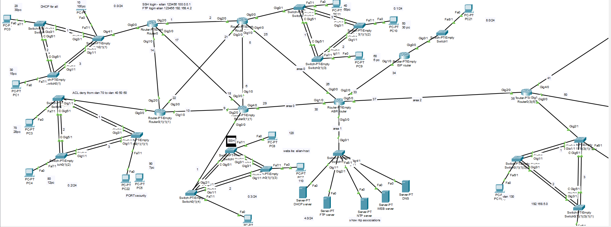

# 🧠 Advanced Cisco Network Topology – Packet Tracer Lab

## 🌐 Lab Overview

This project simulates a complex, enterprise-grade network environment using Cisco Packet Tracer. It includes dynamic routing, VLAN segmentation, multiple server roles, and secure management protocols.

---

## 🔧 Key Features

- 🧱 **VLAN Segmentation**
  - VLANs: 10, 20, 30, 40, 50, 60, 70, 80, 90, 110, 120, 130
  - Access Control Lists (ACLs) to control inter-VLAN communication (e.g. VLAN 70 → 40/50/60 blocked)

- 🔄 **OSPF Multi-Area Routing**
  - 4 routers with full OSPF configuration
  - Area 0 (Backbone), Area 1, and Area 2
  - ABR (Area Border Router) handling inter-area routing

- 🔌 **EtherChannel Implementation**
  - Link aggregation between switches for redundancy and increased bandwidth

- 🔐 **SSH Management**
  - Secure remote access to network devices  
    - Login: `elian / 123456`  
    - IP: `192.168.4.2` or `100.0.0.1`

- 🧩 **DHCP Server**
  - Auto IP addressing for all VLANs

- 🌐 **DNS & HTTPS/HTTP Web Server**
  - DNS resolution for local services
  - Website hosted on `elian-host`

- ⏰ **NTP Server**
  - All network devices are time-synced via NTP

- 📂 **FTP Server**
  - For file transfers and config backups

---

## ✅ Tested Scenarios

- ✅ Ping and connectivity between permitted VLANs  
- ✅ DNS name resolution and web access  
- ✅ SSH login and command execution  
- ✅ NTP time synchronization  
- ✅ DHCP leases assigned correctly

---

## 📁 File Info

- **`photo2.png`** – Full topology visual
- This lab is 100% functional and tested inside **Cisco Packet Tracer**

---

> Built and maintained by Elian Sweed  
> 💡 For educational and lab simulation purposes
