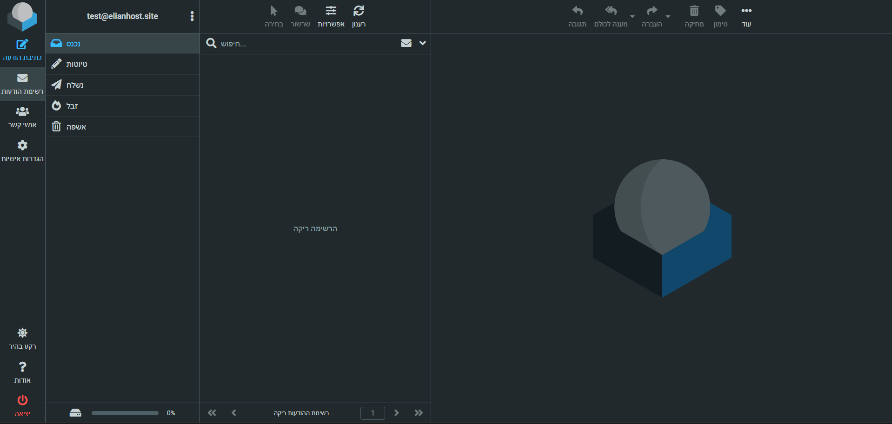
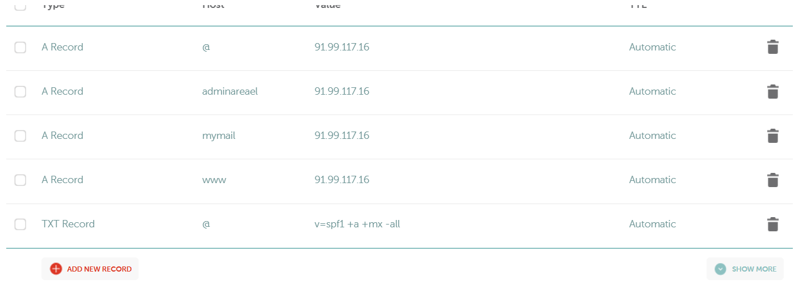

# 🌐 ElianHost Project – WHMCS Hosting Environment

> **Live Site**: [https://www.elianhost.site](https://www.elianhost.site)

This is a fully configured and security-hardened WHMCS-based hosting environment, built from scratch for learning, demonstration, and portfolio purposes. Although not used for commercial activity, this project reflects the effort and attention required to run a secure, client-facing hosting service.

---

## 🧰 Tech Stack

- ✅ WHMCS (Hosting Billing & Management)
- ✅ aaPanel (Server Control Panel)
- ✅ PHP (Custom version installed via aaPanel)
- ✅ Apache / Nginx
- ✅ Roundcube Webmail
- ✅ Namecheap DNS
- ✅ MySQL
- ✅ SSL via Let's Encrypt

---

## ⚙️ What I Did

### 🔧 Installation & Setup

- Installed **aaPanel** to manage server and install PHP
- Deployed **WHMCS**, configured the database, and customized billing automation
- Registered domain on **Namecheap** and connected DNS records
- Created professional subdomains:
  - `mymail.elianhost.site` for Roundcube Webmail
  - `adminareael.elianhost.site` for WHMCS Admin Panel (with non-default port and hardened path)

---

### 📬 Roundcube Webmail

> 📸 Screenshot:

- Roundcube configured on subdomain
- Used for internal mail like `test@elianhost.site`
- Mail panel fully functional with inbox, sending, spam, and contact management

---

### 🌐 Subdomain & DNS Configuration

> 📸 DNS Records (Namecheap):

- `@` → Main domain
- `adminareael` → Admin panel (custom hardened location)
- `mymail` → Roundcube Webmail
- `www` → Redirect to main domain
- `TXT` Record → SPF to protect from spoofing

---

## 🔒 Security Highlights

Security was a top focus of this project. Here’s what I implemented:

- 🔐 **FTP Port Changed** – Avoids brute-force attacks on standard ports
- 🚫 **SSH Disabled** – Full SSH access is disabled
- 🛡️ **Nmap Hardening** – Obfuscated version detection (`nmap -sV` shows no real data)
- 🔍 **Admin Panel Hidden** – On a non-standard port and secret path
- 🚫 **Login Protection** – After 3 failed login attempts (any username), the IP is blocked
- ✅ **SSL Encryption** – All traffic is encrypted via Let's Encrypt
- 🔏 **Hardened Headers** – X-Frame-Options, X-XSS-Protection, and others set
- 🧱 **Firewall Rules** – Only required ports are open

---

## ✨ Project Goals

- ✅ Learn real-world WHMCS configuration and management
- ✅ Create a live simulation of a professional hosting company
- ✅ Practice server administration, web security, and DNS setup
- ✅ Demonstrate a complete, working webmail solution
- ✅ Build a portfolio-quality project to showcase capabilities

---

## 🤝 Contact

Want to discuss the setup or see more? Feel free to open an issue or fork this repo and connect.

---

📁 **Note**: This project is for educational and showcase purposes only.
